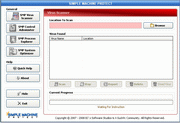



## Simple Machine Protect v1\.7\.7

### Description

Simple Machine Protect is portable anti virus software for your Windows Operating System, built to remove certain variant of virus, worm, trojan and spyware from your computer. Simple Machine Protect is free to distribute, and free to use. Simple Machine Protect was designed to be a simple, open source anti virus scanner. Key Features: * Portable. * Scan all files or use the extensions list. * Scan specified location. * Reporting Service (log file). * Memory system scanning and terminate immediately when virus is detected. * Beep sound when virus is detected. * Repairing registry values. * Recover hidden files (hidden and superhidden). * Repair the infected files. * Estimate scanning with progressbar. * Percentage of scanning progress. * Friendly Interface and Use. * Controlled Windows order. * View running processes. * Terminate or suspend running processes. * View process information. * View memory information and cpu usage. * Make Windows run faster. * Quick jump to Windows System Tools. * Clean the junk files. * Clean recycle bin. * Exit Windows (Log Off, Restart, Shutdown).

new updates

1. Real Time Protector

2. Heuristic Scanning

3. Quarantined Virus

4. Checksum CRC 16
 
### More Info
 

             |
---                |---
**Submitted On**   |2008-04-16 10:24:28
**By**             |[X\_Suck91](https://github.com/Planet-Source-Code/PSCIndex/blob/master/ByAuthor/x-suck91.md)
**Level**          |Intermediate
**User Rating**    |5.0 (10 globes from 2 users)
**Compatibility**  |VB 6\.0
**Category**       |[Complete Applications](https://github.com/Planet-Source-Code/PSCIndex/blob/master/ByCategory/complete-applications__1-27.md)
**World**          |[Visual Basic](https://github.com/Planet-Source-Code/PSCIndex/blob/master/ByWorld/visual-basic.md)
**Archive File**   |[Simple\_Mac2110964282008\.zip](https://github.com/Planet-Source-Code/x-suck91-simple-machine-protect-v1-7-7__1-70468/archive/master.zip)

